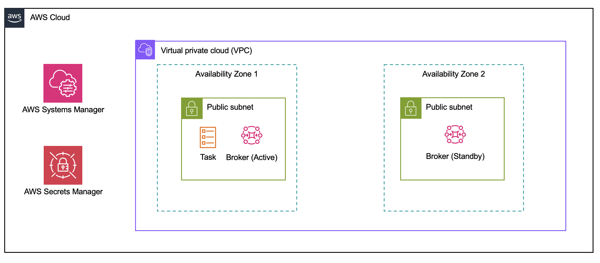

# Overview
This AWS Cloud Development Kit (CDK) application deploys an `active/standby` Amazon MQ broker which is an instance type of `mq.m5.large`. The stack also deploys an Amazon Elastic Container Service (ECS) Cluster with a task. This task runs a Docker image, which should be provided via a Docker Image Repository URL at deployment time. You also have the option to override parameters when deploying to modify the instance type and other configuration details documented below. Once the application deploys successfully you will be given an exec command as an output for you to exec into a running Fargate task to then perform your benchmarking.

# Architecture
The architecture below shows the resources deployed as part of this CDK application deployment:


# Prerequisites
* [AWS CLI](https://docs.aws.amazon.com/cli/latest/userguide/getting-started-install.html) (version 2.1.31 or later)
* [Session Manager plugin for the AWS CLI](https://docs.aws.amazon.com/systems-manager/latest/userguide/session-manager-working-with-install-plugin.html)
* Docker container image built and hosted locally or in a Amazon Elastic Container Registry (ECR) repository based on the sample provided [here](https://github.com/aws-samples/mq-benchmarking-container-image-sample)
* Ensure you have an up-to-date Python install available (Preferrably Python 3.7 or later), and [AWS CDK
v2](https://docs.aws.amazon.com/cdk/v2/guide/home.html) installed.

# Setting up
* Clone this repo
* In the cloned repo, create a Python virtual environment: `python -m venv .venv`
* Activate your virtual environment: `source .venv/bin/activate`
* Install the Python dependencies: `pip install -r requirements.txt`
* Ensure you have suitable AWS credentials configured in your environment

# Usage
You can deploy the application using the following command:
```
 cdk deploy "*" -c container_repo_url=<YOUR CONTAINER REPO URL> -c container_repo_tag=<YOUR CONTAINER REPO TAG>
 ```
 This will will deploy the application with the Docker Image Repository URL specified. You can also override some default context variables.

 :warning: **Important!** If you don't provide the context variables `container_repo_url` and `container_repo_tag` the deployment will fail.
 
  A full list of all the context variables available are displayed in the table below alongside the default values:

| Context Variable    | Description                                                                                                      | Default Value       |
|---------------------|------------------------------------------------------------------------------------------------------------------|---------------------|
| `vpc_cidr`          | Configures the VPC with the CIDR value specified here.                                                           | `10.42.0.0/16`      |
| `mq_cidr`           | Represents the security group CIDR range of the MQ broker.                                                       | `0.0.0.0/0`         |
| `broker_instance_type` | You can specify the instance type for the Amazon MQ Broker which will be deployed.                             | `mq.m5.large`       |
| `mq_username`       | The username for ActiveMQ web console access.                                                                    | `workshopUser`      |
| `tasks`             | Number of Fargate tasks to run with your Docker image.                                                           | `1`                 |
| `container_repo_url`| Repository URL where your Docker image is hosted.                                                                 | <span style="color:red">:warning: **Required at deployment**</span>       |
| `container_repo_tag`| Tag of the version of the Docker image you want to pull.                                                          | <span style="color:red">:warning: **Required at deployment**</span>       |

An example of all the context variables passed in via the command line is shown below:
```
cdk deploy "*" -c vpc_cidr=10.0.0.0/16 -c mq_cidr=0.0.0.0/0 -c broker_instance_type=mq.m5.large -c mq_username=testuser -c tasks=2 -c container_repo_url=<YOUR CONTAINER REPO URL> -c container_repo_tag=<YOUR CONTAINER REPO TAG>
```
The password for accessing your Amazon MQ Broker is generated and stored during deployment using AWS Secrets Manager. The secret ARN is output once the application is deployed, make sure to specify this along with the region where this app is deployed. You can retrieve this by accessing Secrets Manager via the AWS Management Console or by the AWS CLI by running the command:
```
aws secretsmanager get-secret-value --secret-id <secret-arn> --region <region>
```
Once this has been deployed you will then be provided an output of an exec command which you will need to enter a Task ARN within the placeholder defined as `<TASK-ARN>`. 

The command output will be like the following:
```
aws ecs execute-command --region us-east-1 --cluster arn:aws:ecs:<REGION>:<AWS ACCOUNT NUMBER>:cluster/<CLUSTER NAME> --task <TASK-ARN> --container <CONTAINER NAME> --command "/bin/bash" --interactive
```

You can retrieve the Task ARN by either navigating to the ECS console via the AWS Management Console, or by running the following command using the AWS CLI:
```
aws ecs list-tasks --cluster <cluster-name> --region <region>
```
Once you have run the ECS Exec command you will then be presented with a terminal which is running inside your container and you can then run the following command below to start benchmarking.

While in the terminal, go to the directory named `activemq-perftest` and run the commands below:

```
mvn activemq-perf:consumer -DsysTest.propsConfigFile=openwire-consumer.properties 
mvn activemq-perf:producer -DsysTest.propsConfigFile=openwire-producer.properties 
```

More comprehensive information can be found [here](https://github.com/aws-samples/amazon-mq-workshop/blob/master/labs/lab-10.md).


You can also test different scenarios by editing the values/parameters in both files named `openwire-consumer.properties` and `openwire-producer.properties` within the container image. 

# Clean up
To remove all the resources which have been deployed by this CDK application, run the following command:
```
cdk destroy "*"
```
You will then be prompted to confirm that you want to proceed with deleting all the stacks. This will begin the process for decomissioning the resources.

## License Summary
This sample code is made available under the MIT-0 license. See the [LICENSE](./LICENSE) file.
